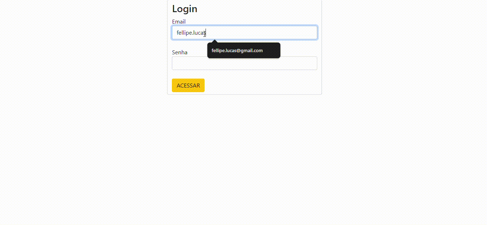

## Projeto Login

Esse código é como um pequeno sistema de controle de acesso, onde você pode adicionar, ver e gerenciar informações sobre os usuários. Ele utiliza a linguagem de programação JavaScript para realizar essas tarefas e interagir com a página web.

2°parte do projeto de validação foi feita a partir da verificação de Email onde a partir de uma implementação javascript o usuário tem que inserir na página um Email valido.

 

**índice**

* [Tecnologias_utilizadas](#tecnologias-utilizadas)
* [Informações adicionais](#informações)
* [Recursos](#Recursos)
* [Autores](#autores)

## Tecnologias utilizadas:

* [<code></code>](https://developer.mozilla.org/pt-BR/docs/Web/HTML)
* [<code></code>](https://github.com/)
* [<code></code>](https://git-scm.com/)
* [<code></code>](https://code.visualstudio.com/)
* [<code></code>](https://fontawesome.com/versions)

## Informações adicionais:

* O projeto consiste em três arquivos:
    * Tela Login (login.html)
    * Tela de recuperação de senha (cadastro.html)
    * Arquivo js (controller.js)
* A primeira tela tem a função de loginde usuário onde o mesmo é redirecionado para cadastro.html.
* Em cadastro.html é utilizado um início de tabela onde o usuário adiciona o nome das pessoas a serem adicionadas a tabela.
* Também contendo na tabela a função de editar e excluir.
* Todas as funções do código são baseados em js com a utilização de arrays.

## Recursos:

* Documentação HTML5: [https://developer.mozilla.org/pt-BR/docs/Web/HTML](https://developer.mozilla.org/pt-BR/docs/Web/HTML)
* Documentação JavaScript: [https://developer.mozilla.org/pt-BR/docs/Web/JavaScript](https://developer.mozilla.org/pt-BR/docs/Web/JavaScript)

**Linkedin**

[publicação do projeto no linkedin](https://www.linkedin.com/posts/fellipe-zanin-1b1a7728b_javascript-html-css-activity-7227638212314189825-ZAp1?utm_source=share&utm_medium=member_desktop)

## Autores
| [ Fellipe Gabriel Zanin](https://github.com/Fell1pe) |

