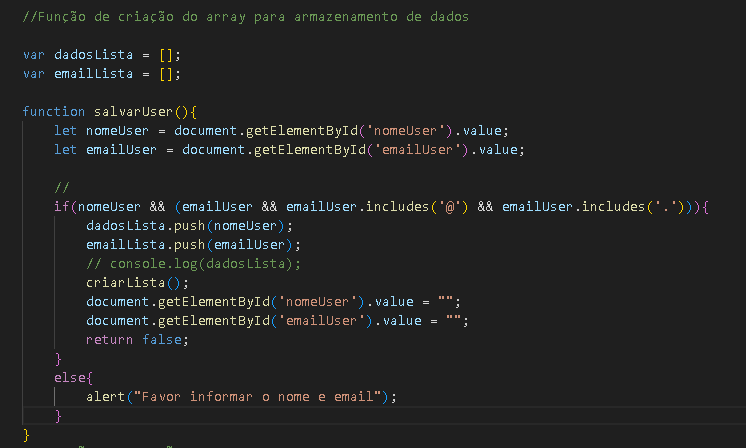
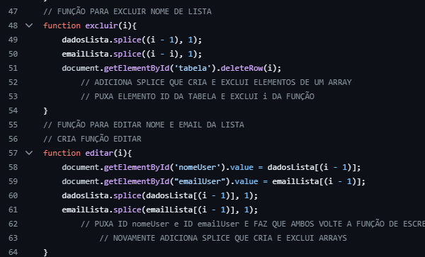
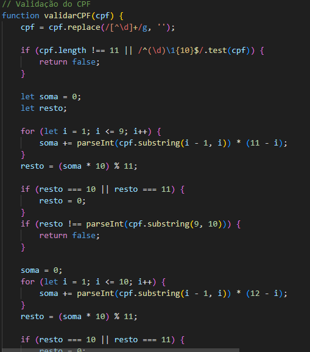

## Projeto Login

Esse código é como um pequeno sistema de controle de acesso, onde você pode adicionar, ver e gerenciar informações sobre os usuários. Ele utiliza a linguagem de programação JavaScript para realizar essas tarefas e interagir com a página web.

* 2° parte do projeto de validação foi feita a partir da verificação de Email onde a partir de uma implementação javascript o usuário tem que inserir na página um Email valido.

* 3° parte do projeto de validação foi feita a inclusão de uma verificação de CPF a partir de javascript.

 

**índice**

* [Tecnologias_utilizadas](#tecnologias-utilizadas)
* [Informações adicionais](#Informações-adicionais)
* [Adição da verificação de email](#adição-da-verificação-de-email)
* [Recursos](#Recursos)
* [Autores](#autores)

## Tecnologias utilizadas:

* [<code></code>](https://developer.mozilla.org/pt-BR/docs/Web/HTML)
* [<code></code>](https://github.com/)
* [<code></code>](https://git-scm.com/)
* [<code></code>](https://code.visualstudio.com/)
* [<code></code>](https://fontawesome.com/versions)

## Informações adicionais:

* O projeto consiste em três arquivos:
    * Tela Login (login.html)
    * Tela de recuperação de senha (cadastro.html)
    * Arquivo js (controller.js)
* A primeira tela tem a função de loginde usuário onde o mesmo é redirecionado para cadastro.html.
* Em cadastro.html é utilizado um início de tabela onde o usuário adiciona o nome das pessoas a serem adicionadas a tabela.
* Também contendo na tabela a função de editar e excluir.
* Todas as funções do código são baseados em js com a utilização de arrays.

## Adição da verificação de email:

* A partir dos códigos criados anteriormente ouve uma adição de uma nova var chamada emailLista.
Logo após dentro da function salvarUser foi adicionado um let emailUser puxando um ID do mesmo (emailUser)
    * As atribuições feitas no if e else da function salvarUser foram reaproveitadas apenas editando o alert mostrado na tela do usuário para melhor compreenção, adicionando também uma variável para a verificação do email, constando se o tal é categorizado como um Email com @ e . também como anteriormente caso essas afirmacões empregadas no if não sejam corretas o código retornara false ao usuário.
## confira o código abaixo:

## Função excluir e editar:

Para uma melhor usabilidade do site foi criado a função de excluir e editar.
    
    SPLICE: CRIA E EXCLUI ELEMENTOS DE UM ARRAY

* excluir:

   * Para essa função funcionar foi criado uma function chamada excluir onde ela pega as variaveis dadosLista e emailLista e insere um splice para que a função seja excluida da tabela.

* editar:

   * para a edição das variáveis foi criada uma function chamada editar onde é criado um document que puxa o ID tanto de nomeUser como de emailUser aplicando um valor a ambos e logo após inserindo um splice que serve para criar esse array novamente assim o editando.
    
## segue o código:

## Adição de CPF

* A partir da utilização do código anterior onde foi feita a verificação do CPF.
    * o mesmo código foi utilizado nesse trabalho para a verificação do CPF e adição na tabela do mesmo 
    funcionando a partir de uma variavel puxada do ID do CPF utilizado no html, onde logo após é criado 
    uma function para validar o CPF que é puxada dentro da função anterior de criar lista assim criando o CPF.

    * todas as outras alterações feitas para a inclusão do CPF foram iguais as feitas para o email.

## segue imagem do código:

## Recursos:

* Documentação HTML5: [https://developer.mozilla.org/pt-BR/docs/Web/HTML](https://developer.mozilla.org/pt-BR/docs/Web/HTML)
* Documentação JavaScript: [https://developer.mozilla.org/pt-BR/docs/Web/JavaScript](https://developer.mozilla.org/pt-BR/docs/Web/JavaScript)

**Linkedin**

[publicação do projeto no linkedin](https://www.linkedin.com/posts/fellipe-zanin-1b1a7728b_javascript-html-css-activity-7227638212314189825-ZAp1?utm_source=share&utm_medium=member_desktop)

## Autores
| [ Fellipe Gabriel Zanin](https://github.com/Fell1pe) |

